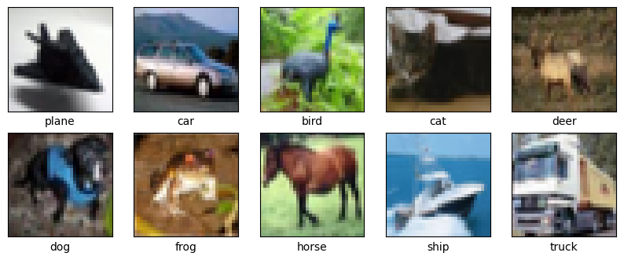

# Classificação de Imagens Usando Modelos de Redes Neurais Convolucionais com PyTorch

Este projeto tem como objetivo explorar três abordagens de classificação de imagens usando CNNs com PyTorch: 

  - Treinamento de uma rede do zero.
  - Uso de uma rede pré-treinada sem ajustes.
  - Fine-tuning de uma rede pré-treinada.
    
O dataset utilizado será o CIFAR-10, e as redes serão avaliadas com métricas como accuracy, precision, recall e F1-score.

## Índice
- [Modelos e Dataset](#modelos-e-dataset)
- [Estrutura do Projeto](#estrutura-do-projeto)
- [Comparação dos modelos](#comparação-dos-modelos)
- [Execução dos Notebooks](#execução-dos-notebooks)
- [Dependências e Pacotes necessários](#dependências-e-pacotes-necessários)
- [GIT](#GIT)

## Modelos e Dataset

### Dataset (**[CIFAR-10](https://pytorch.org/vision/stable/generated/torchvision.datasets.CIFAR10.html)**)
O CIFAR-10 (Canadian Institute For Advanced Research) é um conjunto de dados utilizado em tarefas de classificação de imagens e treinamento de modelos de aprendizado de máquina. Ele consiste em:

- **10 classes**: avião, automóvel, pássaro, gato, cervo, cachorro, sapo, cavalo, navio e caminhão.
- **60.000 imagens coloridas**, de 32x32 pixels.
  - **50.000 imagens** no conjunto de treinamento.
  - **10.000 imagens** no conjunto de teste.
- As imagens estão em formato **RGB**, e cada uma é associada a um rótulo de classe correspondente.
- As classes são mutuamente exclusivas e não possuem sobreposição entre as categorias.

Amostra de imgens CIFAR-10:




### MODELOS USADOS

| Membro       | Modelo       | Link colab   | Arquivo local |
|--------------|--------------|--------------|--------------|
| André Burger | [ResNet](https://arxiv.org/pdf/1512.03385) | [Resnet Colab](https://colab.research.google.com/drive/1M1eeeHHmgKFrja_KyUTXdi-3_GwbaN3_?authuser=2#scrollTo=GWOqLiH6hAwA)| [Resnet Notebook](notebooks/Andre_CNN_ImageClassification.ipynb) |
| Lucas Soares | [Inception v3](https://arxiv.org/pdf/1512.00567) | [Inception Colab](https://colab.research.google.com/drive/1hktJRINsbrDC2DUcVl4zQ8c4iNNBvc9x?authuser=1) | - |
| Pedro Flores | [MaxVit](https://arxiv.org/pdf/2204.01697) | [MaxVit Colab](https://colab.research.google.com/drive/1Yfw5a8teZmHW33w4MfSsCCUnkSreMIMX?usp=sharing) | - |

## Estrutura do Projeto
Cada modelo foi treinado e inferido em uma estrutura padronizada, esse processo foi repetido para as três versões do mesmo modelo:
  - Treinamento de uma rede do zero.
  - Uso de uma rede pré-treinada sem ajustes.
  - Fine-tuning de uma rede pré-treinada.

### Estrutura
1. Download do dataset
2. Plotagem de imagens do dataset
3. Modelos, critérios e otimizadores das redes
4. Treino das redes
5. Plotagem das métricas de avaliação das redes

## Comparação dos modelos
Algumas plotagens e inferências visando comparar a eficiência dos modelos escolhidos.

### **Matriz de confusão:**
A matriz de confusão mostra o número de classificações corretas e incorretas em cada classe. Comparando as matrizes de confusão dos modelos, é possível identificar quais classes foram mais facilmente reconhecidas e onde os erros de classificação foram mais frequentes.


### **Métricas de avaliação**
As métricas de avaliação incluem a `acurácia`, `precisão`, `recall` e `F1-score`, que fornecem uma visão quantitativa do desempenho dos modelos. A acurácia mede a proporção de previsões corretas, enquanto a precisão indica a porcentagem de classificações corretas para uma determinada classe. O recall mede a capacidade do modelo de identificar todas as instâncias de uma classe, e o F1-score oferece um balanço entre precisão e recall. Essas métricas são fundamentais para a comparação objetiva dos modelos em relação à sua capacidade de generalização.


## Execução dos Notebooks
Os modelos usados nesse projeto foram treinados e executados em ambiente Jupyter. Os Notebooks com os códigos se disponibilizam em dois ambientes:
- Google Colab
- Ambiente local

### Google colab
O Google Colab é uma plataforma gratuita baseada na nuvem que permite criar e executar notebooks Jupyter diretamente no navegador. O Colab fornece acesso a GPUs e TPUs gratuitamente.
A execução do código em ambiente colab é simples, basta conectar o Notebook ao servidor do Google e executar as células.

### Ambiente Local
Os arquivos com extensão `.ipynb` podem ser executados localmente instalando as bibliotecas e dependências necessárias. Os pesos gerados pelos modelos já treinados também podem ser instalados através da pasta `/models_weights`.


## Dependências e Pacotes necessários

Caso necessário a utilização de uma máquina local, as bibliotecas usadas no projeto podem ser encontradas no arquivo `requirements.txt`. A criação de um ambiente virtual ajuda com o controle de pacotes.
A instalação das bibliotecas pode ser executada da seguinte maneira no terminal:

```bash
  pip install -r requirements.txt
```

## GIT
Passo a passo de como usar os comandos de GIT para trabalhar em grupo no projeto.

1. Clone o repositório.
   
Cada participante deve clonar o repositório em sua máquina local:
```bash
git clone https://github.com/webdepp1/CNN_ImageClassification
```

2. Criar uma Branch para trabalhar.

Cada participante deve criar uma nova branch para trabalhar em suas alterações:
```bash
git checkout -b nome-da-sua-branch
```

3. Fazer alterações e commit.

Após realizar as alterações no código:
```bash
git add .
git commit -m "Descrição das mudanças feitas"
```

4. Sincronizar com o Repositório Remoto.

Antes de enviar suas alterações, é importante garantir que a branch principal (geralmente chamada de *main* ou *master*) esteja atualizada:
```bash
git checkout main
git pull origin main
git checkout nome-da-sua-branch
```

5. Mesclar Atualizações da Branch Principal.

Se houver atualizações na branch principal, você deve mesclá-las na sua branch:
```bash
git merge main
```

6. Enviar suas Alterações para o GitHub.

Agora, envie suas alterações para o repositório remoto:
```bash
git push origin nome-da-sua-branch
```

7. Atualizar a Branch Principal Localmente.

Após a mesclagem, atualize sua cópia local da branch principal:
```bash
git checkout main
git pull origin main
```

8. Remover a Branch Local.

Depois que suas alterações forem mescladas, você pode remover a branch localmente:
```bash
git branch -d nome-da-sua-branch
```

9. Repetir o processo.

Os participantes podem repetir esses passos para novas funcionalidades ou correções.


